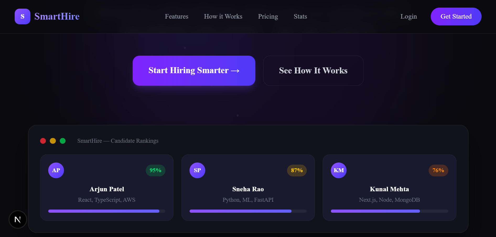
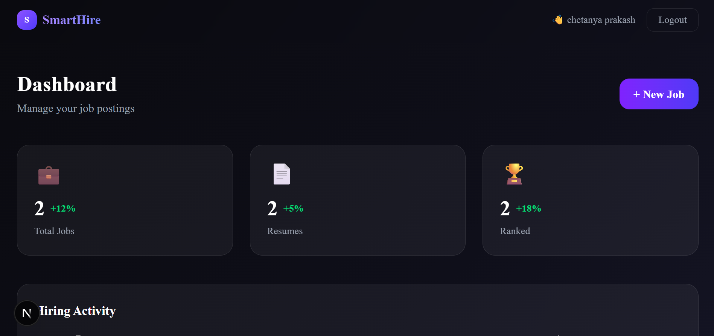
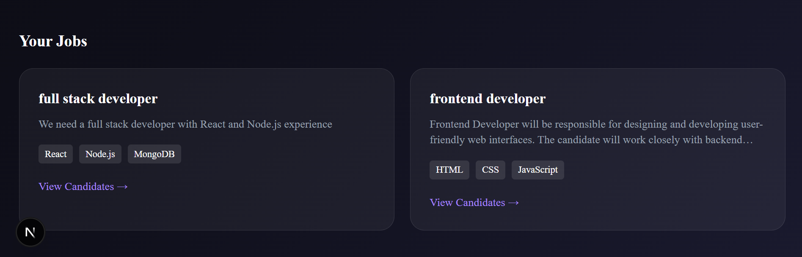

# 🤖 SmartHire — AI-Powered Recruitment Platform

**Stop reading 200 resumes manually. Let AI do it.**

[Live Demo](#) · [Report Bug](issues) · [Request Feature](issues)

---

## ✨ What is SmartHire?

SmartHire is an **AI-powered hiring platform** that automatically screens and ranks candidates based on how well their resumes match your job requirements — using real NLP and semantic similarity, not just keyword matching.

Upload 100 resumes → Get ranked results in seconds. 🚀

---

## ❓ Why SmartHire?

Recruiters spend hours manually reviewing resumes and often rely on keyword-based filtering, which can miss highly qualified candidates.

SmartHire solves this problem by:
- 🧠 Understanding the semantic meaning of resumes (not just keywords)
- ⚡ Automatically ranking candidates based on job relevance
- ⏱️ Saving hours of manual screening effort

🚀 Result: Faster, smarter, and more efficient hiring.

---

## 💡 What Makes SmartHire Different?

- ❌ Not keyword-based filtering  
  ✅ Uses semantic AI matching (understands meaning)

- ⚡ Can process and rank 100+ resumes in seconds  

- 🧠 Uses NLP + Transformers (spaCy + sentence-transformers)

- 📊 Provides structured candidate ranking instead of manual screening  

- 🎯 Reduces human bias in initial screening process

---

## 📊 Sample Output

| Candidate | Score | Skills Matched | Missing Skills |
|----------|------|----------------|----------------|
| John Doe | 87%  | React, JavaScript | Node.js |
| Jane Smith | 72% | HTML, CSS | React |

---

## 🏗️ Architecture

Frontend (Next.js)  
        ↓  
Backend API (Flask)  
        ↓  
AI Processing (NLP + Transformers)  
        ↓  
MongoDB Database  

---

## 💼 Use Cases

- 🏢 Startups screening large number of applicants  
- 👨‍💼 HR teams automating resume filtering  
- 🎓 Students analyzing their resume strength  

---

## 🚀 Future Improvements

- AI-based interview question generation  
- Candidate skill gap analysis  
- Resume feedback system  
- Email notifications for recruiters  
- Multi-language resume support  

---

## 🖼️ Screenshots

### Homepage & Dashboard

| Homepage | Dashboard |
|----------|-----------|
|  |  |

### Job Page

---

## 🎯 Key Features

- **🧠 AI Resume Scoring** — Uses `sentence-transformers` to semantically match resumes with job descriptions  
- **📄 PDF Parsing** — Extracts text from any PDF resume using PyPDF2  
- **🎯 Skill Extraction** — Automatically identifies skills from resume text using spaCy NLP  
- **🏆 Candidate Ranking** — Sorts candidates by AI match score (highest to lowest)  
- **🔐 JWT Authentication** — Secure login/signup with bcrypt password hashing  
- **💼 Job Management** — Create, view, and manage multiple job postings  
- **📊 Dashboard** — Real-time stats and candidate overview  
- **✨ Smooth Animations** — Framer Motion powered UI with premium feel  

---

## 🛠️ Tech Stack

### Frontend

| Technology | Purpose |
|------------|---------|
| Next.js 15 | React framework |
| TypeScript | Type safety |
| Tailwind CSS | Styling |
| Framer Motion | Animations |
| Shadcn UI | UI components |

### Backend

| Technology | Purpose |
|------------|---------|
| Python + Flask | REST API server |
| Flask-CORS | Cross-origin requests |
| PyJWT + bcrypt | Authentication |
| PyPDF2 | PDF text extraction |
| spaCy | NLP skill extraction |
| sentence-transformers | AI semantic matching |
| scikit-learn | Cosine similarity |

### Database & Infrastructure

| Technology | Purpose |
|------------|---------|
| MongoDB Atlas | Cloud database |
| pymongo | MongoDB driver |
| python-dotenv | Environment variables |

---

## 🚀 Getting Started

### Prerequisites

- Node.js (v18+)  
- Python (v3.9+)  
- MongoDB Atlas account  
- Git  

---

## 🔌 API Endpoints

### Auth
- POST `/api/auth/signup`
- POST `/api/auth/login`

### Jobs
- POST `/api/jobs/create`
- GET `/api/jobs/all`
- GET `/api/jobs/:job_id`
- DELETE `/api/jobs/delete/:job_id`

### Resume
- POST `/api/resume/upload/:job_id`
- GET `/api/resume/results/:job_id`

---

## 🧠 How the AI Works
Job Description → Vector
Resume → Vector
↓
Cosine Similarity
↓
Score (%)
↓
Rank Candidates

---

## 📄 License

MIT License

---

## 👨‍💻 Author

**Chetanya Prakash**

> Built with ❤️ and a lot of chai ☕

---

⭐ Star this repo if SmartHire helped you! ⭐

## 📁 Project Structure
SmartHire/
├── frontend/
├── backend/
├── screenshots/
└── README.md

