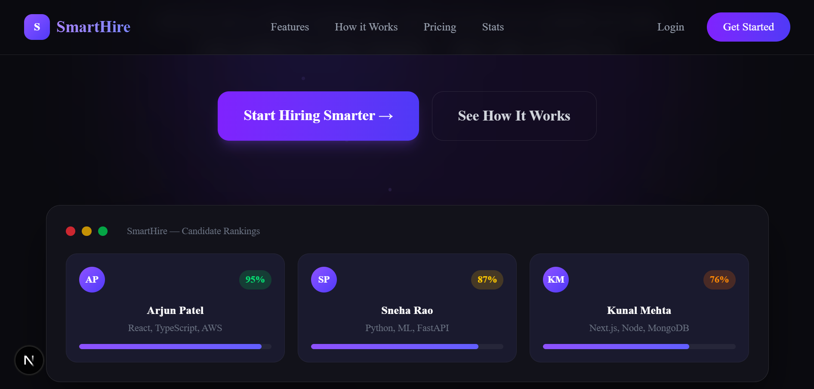
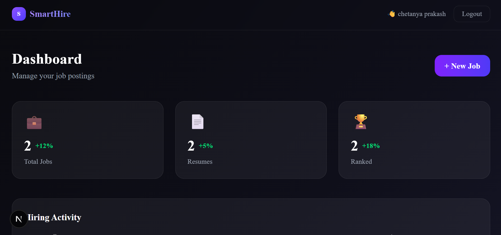
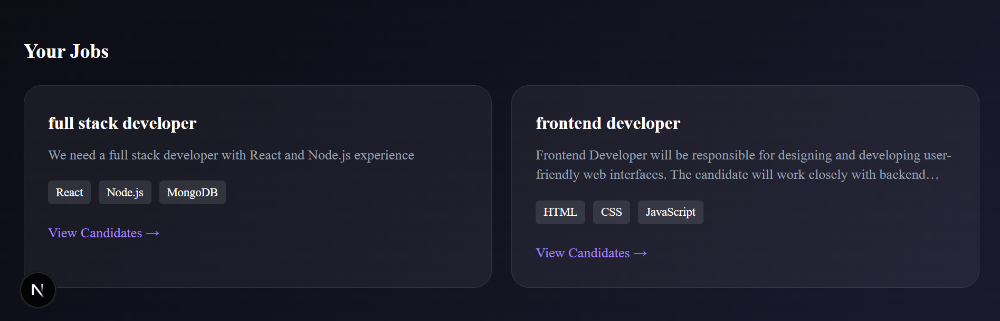
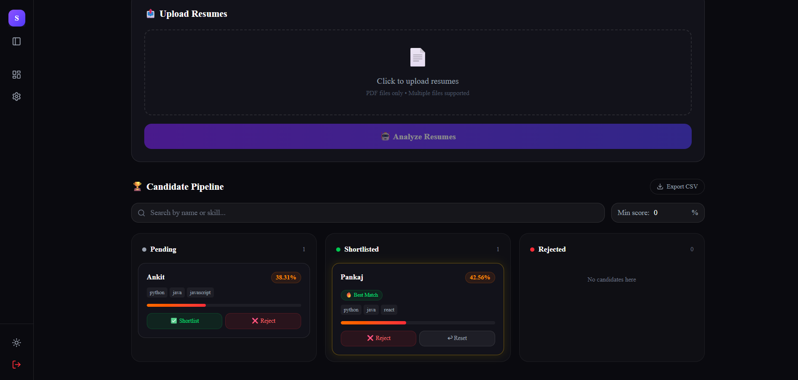
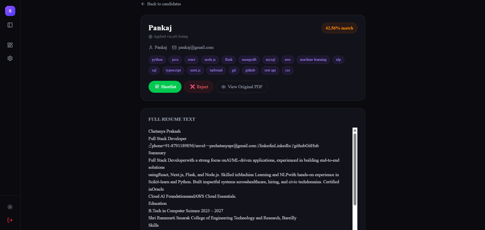
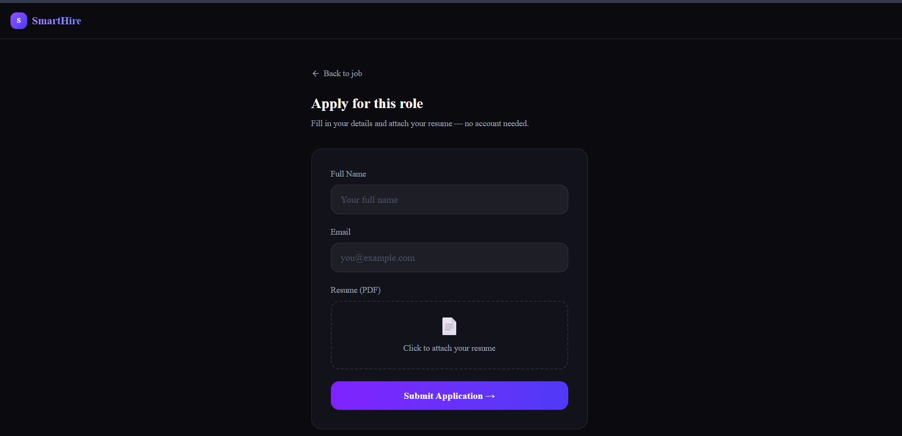
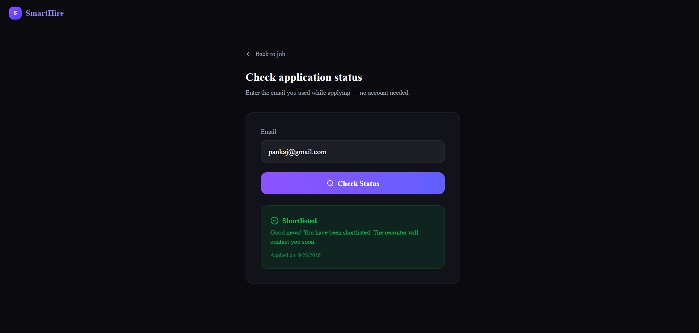
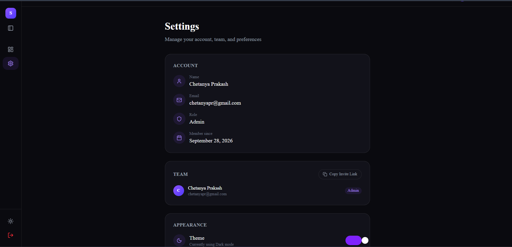
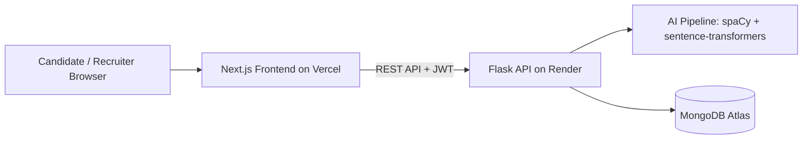

# 🤖 SmartHire — AI-Powered Recruitment Platform

<div align="center">


**Stop reading 200 resumes manually. Let AI do it.**

[](https://nextjs.org/)
[](https://www.typescriptlang.org/)
[](https://tailwindcss.com/)
[](https://flask.palletsprojects.com/)
[](https://www.mongodb.com/atlas)
[](https://www.framer.com/motion/)
[](LICENSE)

[🌐 Live Demo](https://smart-hire-lake.vercel.app) · [🐛 Report Bug](https://github.com/chetanyapr-sys/Smart-HIre/issues) · [💡 Request Feature](https://github.com/chetanyapr-sys/Smart-HIre/issues)

</div>

---

## 📑 Table of Contents

- [What is SmartHire?](#-what-is-smarthire)
- [Why SmartHire?](#-why-smarthire)
- [Screenshots](#-screenshots)
- [Key Features](#-key-features)
- [Architecture](#-architecture)
- [Tech Stack](#-tech-stack)
- [Getting Started](#-getting-started-local-setup)
- [Environment Variables](#-environment-variables)
- [Deployment](#-deployment)
- [API Endpoints](#-api-endpoints)
- [Security](#-security)
- [Troubleshooting](#-troubleshooting)
- [Roadmap](#-roadmap)
- [Contributing](#-contributing)
- [License](#-license) · [Author](#-author)

---

## ✨ What is SmartHire?

SmartHire is an **AI-powered hiring platform** that screens and ranks candidates by how well their resumes match your job requirements, using NLP and semantic similarity instead of plain keyword matching.

Recruiters post jobs, candidates apply through a public link (or recruiters upload resumes directly), and SmartHire scores every resume against the job description. Recruiters then manage candidates on a Kanban board, add internal notes, preview original resumes and collaborate with their team.

> 🌐 **Try it live:** [smart-hire-lake.vercel.app](https://smart-hire-lake.vercel.app)
>
> ⏳ The backend runs on a free hosting tier and sleeps when idle, so the **first request can take 30–60 seconds**. After that it is fast.

---

## ❓ Why SmartHire?

Recruiters spend hours manually reviewing resumes and often rely on keyword filters, which can miss qualified candidates.

SmartHire helps by:
- 🧠 Understanding the semantic meaning of resumes (not just keywords)
- ⚡ Automatically ranking candidates by job relevance
- ⏱️ Saving hours of manual screening effort
- 🤝 Giving the whole hiring team one place to review, discuss and decide

### 💡 What makes it different?

| Traditional screening | SmartHire |
|---|---|
| Keyword filters miss synonyms and context | Semantic matching understands meaning |
| Spreadsheets and email threads | Kanban pipeline with team notes |
| Candidates never hear back | Candidates can track status with just their email |
| Manual skill hunting | Automatic skill extraction, matched vs missing skills |

---

## 📊 Sample Output

| Candidate | Score | Skills Matched | Missing Skills |
|----------|------|----------------|----------------|
| John Doe | 87%  | React, JavaScript | Node.js |
| Jane Smith | 72% | HTML, CSS | React |

---

## 🖼️ Screenshots

### Homepage & Dashboard

| Homepage | Dashboard |
|----------|-----------|
|  |  |

### Jobs



### Recruiter Workflow

| Kanban Board | Candidate Detail (Skills + PDF Preview) |
|--------------|------------------------------------------|
|  |  |

### Candidate Experience (No Login Needed)

| Apply to a Job | Track Application Status |
|----------------|--------------------------|
|  |  |

### Team



---

## 🎯 Key Features

### 🧠 AI Screening
- **AI Resume Scoring**: `sentence-transformers` (`all-MiniLM-L6-v2`) semantically matches resumes with job descriptions
- **PDF Parsing**: extracts text from PDF resumes with PyPDF2
- **Skill Extraction**: identifies skills from resume text using spaCy and a curated skill list
- **Candidate Ranking**: sorts candidates by match score, highest first
- **Best Match badge** for the top-scoring candidate

### 👔 For Recruiters
- **Kanban Board**: move candidates between Pending, Shortlisted and Rejected
- **Search & Filter**: search by name or skill and set a minimum match score
- **Internal Notes**: private team notes on every candidate, with author name and timestamp
- **Resume PDF Preview**: open the original resume in one click
- **Export CSV**: download a job's candidate list
- **Job Management**: create, view and delete job postings
- **Dashboard**: stats and job overview

### 🌍 For Candidates (No Account Required)
- **Public Job Board**: browse open jobs and view details
- **Public Apply**: apply directly with a resume PDF
- **Duplicate Application Detection**: one application per job per email
- **Application Status Tracking**: check status with just your email; only the status and applied date are shown, nothing else

### 👥 Teams & Access
- **Team Workspaces**: invite teammates through a signup link
- **Roles**: Admin and Recruiter
- **Team-scoped jobs** on the jobs endpoints

### 🎨 Experience
- **Light / Dark theme**
- Smooth **Framer Motion** animations
- Responsive layout

---

## 🏗️ Architecture


```mermaid
flowchart LR
    A[Candidate / Recruiter Browser] --> B[Next.js Frontend on Vercel]
    B -->|REST API + JWT| C[Flask API on Render]
    C --> D[AI Pipeline: spaCy + sentence-transformers]
    C --> E[(MongoDB Atlas)]
```

### 🧠 How the AI Works

```
Job Description → Vector
Resume          → Vector
        ↓
 Cosine Similarity
        ↓
   Score (%) + Skill Match
        ↓
   Rank Candidates
```

1. The resume PDF is parsed to text (PyPDF2).
2. spaCy and a skill list extract the candidate's skills.
3. `all-MiniLM-L6-v2` converts the job description and the resume into embeddings.
4. Cosine similarity gives the match score, which is stored with the candidate and used for ranking.

---

## 🛠️ Tech Stack

### Frontend

| Technology | Purpose |
|------------|---------|
| Next.js 16 (App Router) | React framework |
| TypeScript | Type safety |
| Tailwind CSS v4 | Styling |
| Framer Motion | Animations |
| Lucide React | Icons |

### Backend

| Technology | Purpose |
|------------|---------|
| Python + Flask | REST API server |
| Gunicorn | Production WSGI server |
| Flask-CORS | Cross-origin requests |
| PyJWT + bcrypt | Authentication |
| PyPDF2 | PDF text extraction |
| spaCy | NLP skill extraction |
| sentence-transformers | Semantic matching |
| scikit-learn | Cosine similarity |

### Database & Deployment

| Technology | Purpose |
|------------|---------|
| MongoDB Atlas | Cloud database |
| pymongo | MongoDB driver |
| Vercel | Frontend hosting |
| Render | Backend hosting |

---

## 🚀 Getting Started (Local Setup)

### Prerequisites

- Node.js (v18+)
- Python 3.11 (recommended)
- MongoDB Atlas account (or any MongoDB URI)
- Git

### 1. Clone the repo

```bash
git clone https://github.com/chetanyapr-sys/Smart-HIre.git
cd Smart-HIre
```

### 2. Backend

```bash
cd backend
python -m venv venv

# Windows (PowerShell)
venv\Scripts\activate
# macOS / Linux
# source venv/bin/activate

pip install -r requirements.txt
python -m spacy download en_core_web_sm
```

Create `backend/.env` (see [Environment Variables](#-environment-variables)), then run:

```bash
python app.py
```

> Restart the backend after editing backend code.

### 3. Frontend

```bash
cd frontend
npm install
```

Create `frontend/.env.local`:

```env
NEXT_PUBLIC_API_URL=http://localhost:5000
```

Run it:

```bash
npm run dev
```

Open [http://localhost:3000](http://localhost:3000).

---

## 🔑 Environment Variables

### Backend (`backend/.env`)

| Variable | Required | Description |
|----------|----------|-------------|
| `MONGODB_URI` | ✅ | MongoDB connection string |
| `SECRET_KEY` | ✅ | Long random secret used to sign JWTs |
| `FRONTEND_URL` | ✅ | Allowed CORS origin(s); comma-separated for multiple |
| `PORT` | ➖ | Server port (default `5000`; set automatically on Render) |
| `FLASK_ENV` | ➖ | `development` or `production` |

### Frontend (`frontend/.env.local`)

| Variable | Required | Description |
|----------|----------|-------------|
| `NEXT_PUBLIC_API_URL` | ✅ | Base URL of the backend, without a trailing slash |

> ⚠️ Never commit real secrets. `.env` files are git-ignored.

---

## ☁️ Deployment

| Part | Platform | Notes |
|------|----------|-------|
| Frontend | Vercel | Root directory `frontend`, env `NEXT_PUBLIC_API_URL` = backend URL |
| Backend | Render | Root directory `backend`, start command `gunicorn app:app --workers 1 --timeout 120` |
| Database | MongoDB Atlas | Dedicated user with `readWrite` on the app database only |

**Render build command:**

```bash
pip install -r requirements.txt && python -m spacy download en_core_web_sm
```

- `requirements.txt` uses CPU-only PyTorch to keep the build small enough for a 512 MB instance.
- Dependency versions are pinned on purpose (`numpy<2.0`, `transformers==4.41.2`, and others). Please do not unpin them.
- Health check: `GET /api/health`

---

## 🔌 API Endpoints

### Auth
| Method | Endpoint | Description |
|--------|----------|-------------|
| POST | `/api/auth/signup` | Create a team, or join one with a team invite |
| POST | `/api/auth/login` | Login, returns JWT |
| GET | `/api/auth/me` | Current user 🔒 |
| GET | `/api/auth/team` | Team members 🔒 |

### Jobs
| Method | Endpoint | Description |
|--------|----------|-------------|
| POST | `/api/jobs/create` | Create a job 🔒 |
| GET | `/api/jobs/all` | Team's jobs 🔒 |
| GET | `/api/jobs/stats` | Dashboard stats 🔒 |
| GET | `/api/jobs/:job_id` | Job details 🔒 |
| DELETE | `/api/jobs/delete/:job_id` | Delete a job 🔒 |
| GET | `/api/jobs/public` | Public job board |
| GET | `/api/jobs/public/:job_id` | Public job details |

### Resume & Candidates
| Method | Endpoint | Description |
|--------|----------|-------------|
| POST | `/api/resume/upload/:job_id` | Recruiter uploads resumes 🔒 |
| POST | `/api/resume/apply/:job_id` | Public application |
| POST | `/api/resume/check-status/:job_id` | Public status check by email |
| GET | `/api/resume/results/:job_id` | Ranked candidates 🔒 |
| GET | `/api/resume/candidate/:candidate_id` | Candidate detail 🔒 |
| PATCH | `/api/resume/status/:candidate_id` | Update candidate status 🔒 |
| GET | `/api/resume/pdf/:candidate_id` | Resume PDF preview 🔒 |
| POST / GET | `/api/resume/notes/:candidate_id` | Add / list internal notes 🔒 |
| GET | `/api/resume/export/:job_id` | Export candidates as CSV 🔒 |

### System
| Method | Endpoint | Description |
|--------|----------|-------------|
| GET | `/api/health` | Health check |

🔒 = requires `Authorization: Bearer <token>`

---

## 🔐 Security

- Passwords are hashed with **bcrypt**; sessions use **JWT**
- CORS is restricted to the configured frontend origin(s)
- Production database access uses a **dedicated least-privilege user**, not an admin account
- Public endpoints expose only what is needed: the status check returns just the status and applied date
- Resume files are stored inside the database and excluded from list and detail responses
- Secrets live only in `.env` files or hosting dashboards, never in the repo

---

## 🩺 Troubleshooting

| Problem | Fix |
|---------|-----|
| First request is very slow | The free backend was asleep; wait 30–60 seconds and retry |
| CORS error in the browser | Make sure `FRONTEND_URL` on the backend exactly matches your frontend URL (no trailing slash) and redeploy |
| Login works locally but not live | Check that `NEXT_PUBLIC_API_URL` points to the deployed backend |
| Backend change not visible locally | Restart the Flask server |
| Build fails with `useSearchParams` error | Wrap the component using it in `<Suspense>` |

---

## 🗺️ Roadmap

- [ ] Email notifications on status changes
- [ ] AI Q&A on resumes (ask questions about a candidate)
- [ ] Team-level access checks on all candidate endpoints
- [ ] AI-based interview question generation
- [ ] Candidate skill gap analysis
- [ ] Resume feedback system
- [ ] Multi-language resume support

---

## 💼 Use Cases

- 🏢 Startups screening a large number of applicants
- 👨‍💼 HR teams automating first-round resume filtering
- 🎓 Students analyzing their resume strength

---

## 📁 Project Structure

```
SmartHire/
├── backend/
│   ├── app.py              # Flask app, CORS, blueprints
│   ├── routes/             # auth, jobs, resume routes
│   ├── utils/              # auth middleware, helpers
│   └── requirements.txt
├── frontend/
│   ├── app/                # Next.js App Router pages
│   │   ├── jobs/           # public job board, apply, status tracking
│   │   └── dashboard/      # recruiter dashboard, Kanban, candidate page, settings
│   ├── components/         # shared components
│   └── lib/                # API helper
├── screenshots/            # README images
└── README.md
```

---

## 🤝 Contributing

Contributions, issues and feature requests are welcome.

1. Fork the repo
2. Create a branch: `git checkout -b feature/my-feature`
3. Commit your changes: `git commit -m "Add my feature"`
4. Push the branch: `git push origin feature/my-feature`
5. Open a Pull Request

---

## 📄 License

MIT License

---

## 👨‍💻 Author

**Chetanya Prakash**

> Built with ❤️ and a lot of chai ☕

---

<div align="center">

⭐ Star this repo if SmartHire helped you! ⭐

</div>